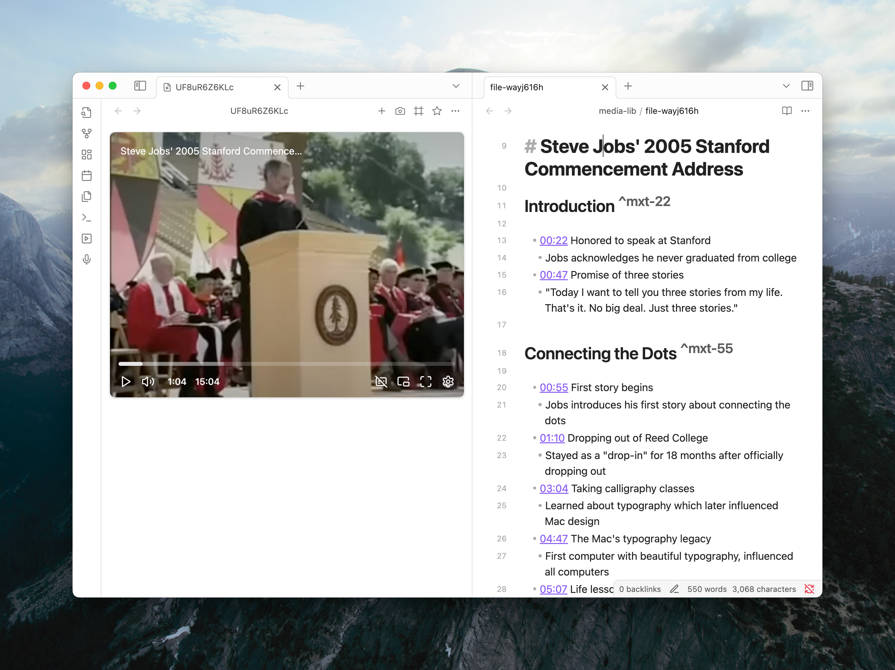

<div align="center">
  <h1>Media Extended</h1>
  <strong>A Media Integration Plugin for Obsidian</strong>
  <p>Integrate, manage, and play media files directly in Obsidian, with playback controls, timestamp links, and more.</p>
  <p>
    <a href="https://mx.pkmer.net">📖 Website</a>
    ·
    <a href="https://mx.pkmer.net/docs/v4">🚀 Getting Started</a>
    ·
    <a href="https://github.com/aidenlx/media-extended/issues">🐛 Issues</a>
  </p>
</div>

> [!WARNING]
> **License Change:** 
> Future releases of v4 will be **closed source**.
> The original codebase up to version 3 remains open source under the MIT license and can be found in the [`v3` branch](https://github.com/aidenlx/media-extended/tree/v3).
> For details, see [v4 Release Notes](https://mx.pkmer.net/blog/v4-release)



## Overview

Media Extended is a plugin that integrates media playback and management into Obsidian. Whether you're a student, researcher, or content creator, this plugin makes it easier to incorporate, control, and reference audio and video materials directly within your digital notebook, preserving Obsidian's philosophy of plain-text, future-proof note-taking.

## ⭐ Key Features

| Feature | Description |
| --- | --- |
| **Broad Media Support** | Open and play local media files, remote URLs, and videos from services like YouTube and Vimeo directly in Obsidian. |
| **Advanced Playback Control** | Control playback with global hotkeys without leaving your notes. Pin a player to avoid tab clutter. |
| **Timestamped Notes** | Insert links to specific moments in your media with a single click or command. Clicking the timestamp jumps to the exact moment. |
| **Screenshot Capture** | Capture screenshots from videos, with options to crop, and embed them in your notes with a timestamp link back to the source. |
| **Interactive Transcripts** | Link transcripts (`.srt`, `.vtt`) to your media. Click to navigate, search the full text, and copy timestamped quotes. |
| **Live Recording Timestamps** | While using Obsidian's audio recorder, drop timestamp markers into your notes that automatically become clickable links when the recording is saved. |
| **Customizable Templates** | Tailor the format of inserted timestamps and screenshot links to fit your personal note-taking workflow. |
| **Powerful Linking** | Create media links and embeds with fragments for start/end times (`#t=...`), looping, and auto-play for precise control. |

## 🚀 Quick Start

**Try it now:** With Media Extended installed, copy the URL below and paste it into your browser's address bar to open Steve Jobs' 
2005 Stanford 
Commencement Address directly in Obsidian.

```txt
obsidian://mx-open?url=https%3A%2F%2Fwww.youtube.com%2Fwatch%3Fv%3DUF8uR6Z6KLc
```

For detailed guides, please refer to the [**Documentation**](https://mx.pkmer.net/docs/v4).

## 🆘 Support

- **Issues & Bug Reports:** [GitHub Issues](https://github.com/aidenlx/media-extended/issues)
- **Questions & Discussions:** Check existing [issues](https://github.com/aidenlx/media-extended/issues) or create a new one

## 🙏 Special Thanks

A special thanks to [bfcs](https://github.com/bfcs) for their valuable contributions. They have helped fix issues during a long period of inactivity and made attempts to implement YouTube transcript functionality!
