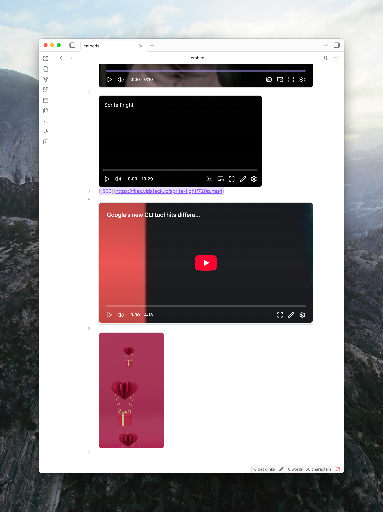

When you embed narrow videos that can't fill your note's full width, they appear centered by default, creating awkward spacing in your text flow. This guide shows you how to left-align them instead.

## When You Need This

This is most useful for:
- Portrait videos (taller than they are wide)
- Videos with explicit width limits using [embed video size support](/docs/v4/media-links#embed-video-size-support) like `![[video.mp4|300]]`

These videos leave empty space on both sides when centered, disrupting your note's reading flow.

## Solution

Add this CSS snippet to your vault:

```css
.mx-media-embed.mx-video-view.custom {
  margin-left: 0;
}
```

Follow the [official guide for adding CSS snippets](https://help.obsidian.md/snippets#Adding+a+snippet) to create and enable this snippet.

## Result

Your width-constrained videos will align to the left margin, integrating better with surrounding text instead of floating in the center.

