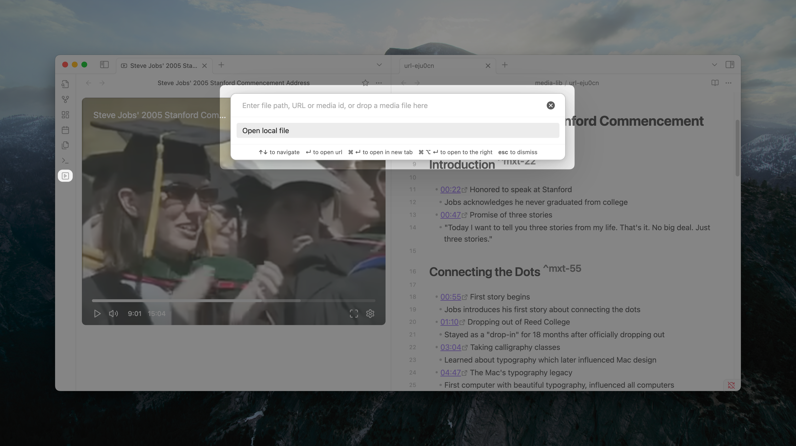

import { FolderIcon, GlobeIcon, VideoIcon, LinkIcon } from 'lucide-react';

<Cards>
  <Card 
    icon={<FolderIcon />} 
    title="Local Files" 
    href="#local-files"
  >
    Open media files from your vault and local hard drive
  </Card>
  <Card 
    icon={<GlobeIcon />} 
    title="Remote Media" 
    href="#publicly-hosted-media-files"
  >
    Stream videos and audio from public URLs
  </Card>
  <Card 
    icon={<VideoIcon />} 
    title="Media-hosting services" 
    href="#media-hosting-services"
  >
    Embed from YouTube, Vimeo, and other platforms
  </Card>
  <Card 
    icon={<LinkIcon />} 
    title="Quick Open" 
    href="#quick-open-from-browser"
  >
    Open media directly from your browser using Obsidian URI
  </Card>
</Cards>

## Media Blob

Media Extended supports opening media files from local files and publicly hosted media files. The [supported formats and codecs](#format-and-codec-support) are determined by obsidian's capabilities.

### Local Files

For media files in your vault, just open it as you would any other file. The plugin will recognize it and open it in the player.

In desktop, we also support opening local media files in your hard drive. You can use media picker to open them without copying them to your vault. You can find it in the ribbon on the left.



You can select files from your hard drive by selecting the `Open local file` option that will show a file picker. Also, you can drag media files from file explorer (Finder) to the media picker to open them.

<Callout type="info">
Similar to quick switcher in obsidian, you can also find it in the command palette by searching for `Media Extended: Open external media`.
</Callout>

### Remote Media Files [#publicly-hosted-media-files]

Media Extended supports opening videos and audio from publicly hosted media files that is not password protected, commonly served via WebDAV, or static file servers.

To open a publicly hosted media file, simply paste its URL into the media picker and press enter. Of course, you can open them from link in your note, as long as `Handle link to remote url` in settings is enabled.

### Format and Codec Support

Media Extended relies on your obsidian's built-in media playback capabilities. This means:

- **Video Formats**: MP4 (H.264), WebM, Ogg in general, (MKV are only supported in Chrome)
- **Audio Formats**: MP3, WAV, Ogg, AAC in general
- **Codecs**: H.264, VP8/VP9, Opus, AAC in general
  - H.265/HEVC and AV1 are supported in obsidian with latest installer version in general.

<Callout type="info">
The exact formats and codecs supported may vary depending on your obsidian version and operating system. For the best compatibility, we recommend using widely supported formats like MP4 (H.264) for video and MP3 for audio. You can test the support by opening a media file in obsidian.
</Callout>

## Media-hosting services 

Media Extended supports opening videos and audio from embedable media hosting services, including YouTube and Vimeo. 

Similar to remote media files, you can open media-hosting services by pasting the url into the media picker and press enter. In addition, you can open YouTube and Vimeo videos [from your browser using Obsidian URI](#quick-open-from-browser).

<Callout type="info">
For v3 users, due to the limitation of obsidian, the general web page player experiencing issues with YouTube loading and authentication has been deprecated in v4. 

That means media hosted in Coursera, bilibili, and other video platforms are not supported in v4, and YouTube and Vimeo video no longer support capturing screenshot. 

We're developing [browser connect](#browser-connect) feature that will provide an improved solution for this functionality. Stay tuned!
</Callout>

### Browser Connect [#browser-connect]

In future releases, we will support opening non-embedable websites via browser connect with the help of an companion browser extension. Stay tuned!

## Quick Open from Browser

Media Extended supports opening remote media url via [Obsidian URI](https://help.obsidian.md/Extending+Obsidian/Obsidian+URI) in two format: 

1. `obsidian://mx-open?url=encoded-link-to-media`, or
2. `obsidian://mx-open/https://link/to/media`, so that you could open it in the player by simply adding `obsidian://mx-open/` prefix to the url in address bar.

You can use bookmarklet to open media in active tab of the browser in one click, with current timestamp. Add the following code to your bookmarklet and follow [the instructions](https://en.wikipedia.org/wiki/Bookmarklet#installation) to create a bookmarklet.

```js copy
javascript:(()=>{const t=document.querySelector("video, audio")?.currentTime,u=new URL(window.location.href);t&&(u.hash?u.hash+=`&t=${t}`:u.hash=`#t=${t}`),window.open(`obsidian://mx-open?url=${encodeURIComponent(u.toString())}`)})();
```