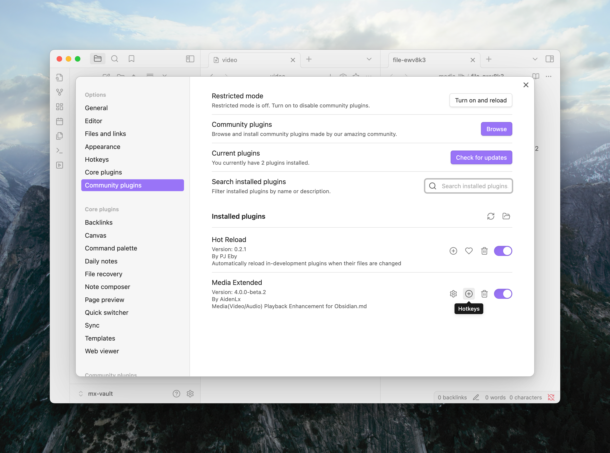
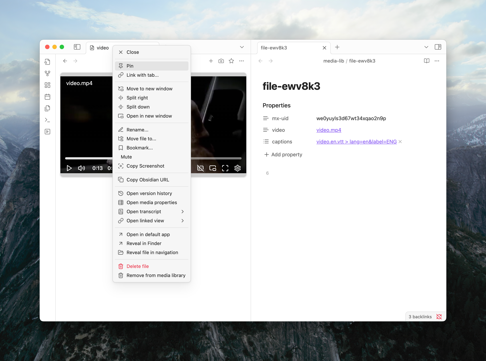

Taking notes on a video usually means a lot of back-and-forth. You watch a bit, pause, switch to your notes, type, then switch back to the video. If you need to rewind to catch something you missed, it's another interruption. This constant context switching can break your flow.

Media Extended helps you stay focused on your notes by letting you control video playback from anywhere with keyboard shortcuts.

## Control Playback from Your Notes

Imagine you're typing notes and want to pause the video. Instead of clicking the pause button in the player, you can set up a hotkey like `Cmd+K` to toggle play/pause without ever leaving your editor. Missed a detail? Press `Cmd+ArrowLeft` to jump back 5 seconds.

These controls are fully customizable. Here's how to set them up:

1. Go to `Settings > Community Plugins`.
2. Select Media Extended's `Hotkeys` button to enter its hotkey settings.
3. Assign your preferred shortcuts to the commands you use most.

Here are a few suggestions to get you started. The hotkeys are just ideas; feel free to use whatever works for you.

| Action                                     | Suggested Hotkey        |
| ------------------------------------------ | ----------------------- |
| `Play/pause`                               | `Cmd or Ctrl + K`       |
| `Rewind 5s`                                | `Cmd or Ctrl + ArrowLeft`  |
| `Forward 5s`                               | `Cmd or Ctrl + ArrowRight` |
| `Set playback speed to 1.5x`               | `Cmd or Ctrl + >`       |
| `Set playback speed to 1x`                 | `Cmd or Ctrl + <`       |
| `Fast forward at 3x by holding hotkey`     | `Cmd or Ctrl + Shift + ArrowRight` |

With these set, you can control the player while your cursor stays right where it belongs: in your notes.

For a full list of available controls, check out the [Command Reference](/docs/v4/commands).

## Quick Actions in the Player

When you're not typing notes and are focused on the player itself, you can use even simpler shortcuts that don't require modifier keys like `Cmd` or `Ctrl`.

- **`Space` or `k`**: Play/Pause
- **`j` / `l`**: Seek backward/forward
- **`m`**: Mute/Unmute
- **`f`**: Toggle fullscreen

These are just a few examples. See the full list of [player-specific hotkeys](/docs/v4/hotkeys).

## Avoid Player Clutter with Pinning

If you're working with multiple videos, your workspace can quickly get cluttered with player tabs. To keep things tidy, you can designate a single player to handle all your media.

Simply **pin** a player tab by right-clicking its tab header and selecting "Pin".

From now on, any new media you open will load in the pinned player instead of opening a new tab. This lets you seamlessly switch between different notes and videos without losing your place or cluttering your workspace.